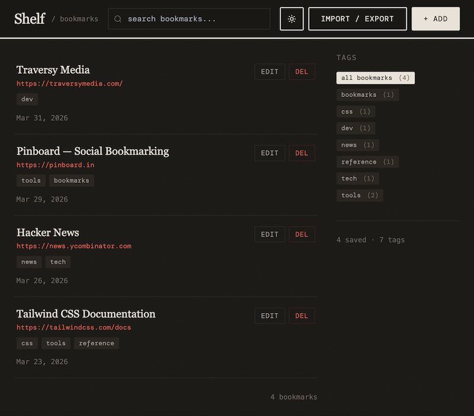

# README

An experiment to vibe-code a barebones, single user clone of the social bookmarking website Pinboard using Claude Code. Bookmarking utilities are undoubtedly easy for LLMs to create given how much prior art already exists out there.

All updates were created [using prompts](docs/prompt-history.md) to help me become more familiar with the process of vibe-coding and its limitations. This is not intended to replace the more professional AI workflow which utilizes skills, subagents, etc. that I'm learning about in Traversy Media's [Coding with AI](https://www.traversymedia.com/coding-with-ai) course.

I tried to convert the static site to a local project built with `npm` and run with `Vite`, but the page was broken and it didn't recognize Tailwind utility classes. Claude to fix it so for now that marks the end of my brief vibe-coding experiment. At some point I will pick this back up and work on fixing the problems myself with Claude's help, as opposed to letting it make all the changes.

## Features

- Reverse-chronological list of bookmarks with title, URL, tags, and save date
- Responsive layout, minimal aesthetic inspired by Pinboard
- Tags are displayed in a sidebar (desktop) or tag strip (mobile)
    - Click any tag to filter
- Input field in header to search across titles, URLs, and tags
- Add/Edit modal with title, URL, and comma-separated tags
- Delete confirmation modal before removing anything
- Export bookmarks (HTML, JSON)
- Import bookmarks (HTML, JSON)
    - Two modes: Merge and replace
- Bookmarks are persisted in localStorage
- Seeded with 3 sample bookmarks

## Tech Stack

- HTML
- Tailwind CSS
- JavaScript
- Local storage

## Improvements

- [ ] Convert from static site to local project built with `npm` and run with `Vite`
- [ ] Create Netlify project with automatic deployment of GitHub repo
- [ ] Store bookmarks in cloud database

## Run locally

For now, open the file `bookmarks.html` directly in the browser.

## Screenshot

